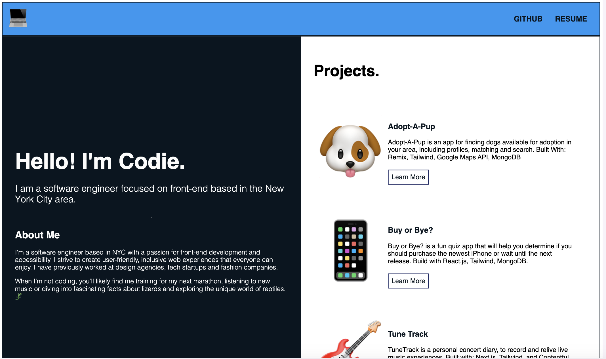
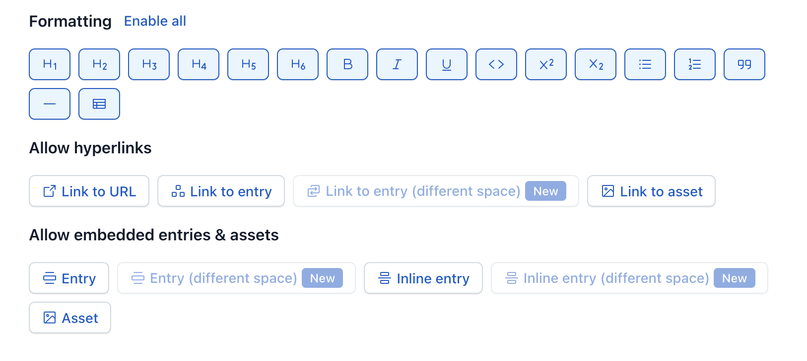
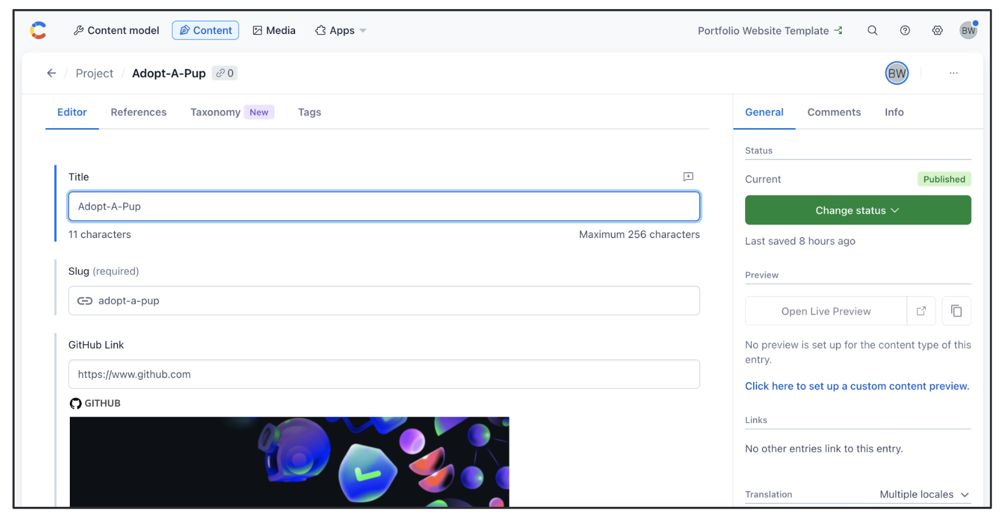

# A simple template portfolio example



## Demo

### [https://starter-portfolio-six.vercel.app/](https://starter-portfolio-six.vercel.app/)


## Configuration

### Step 1. Create an account and a space on Contentful

First, [create an account on Contentful](https://www.contentful.com/sign-up/).

After creating an account, create a new empty **space** from the [dashboard](https://app.contentful.com/) and assign to it any name of your liking.

### Step 2. Create a content model

The [content model](https://www.contentful.com/developers/docs/concepts/data-model/) defines the data structures of your application/websites. The structures are flexible and you can tailor them to your needs.

For this example you need to create a content model that defines an author and a post content type. **You can create these two by running a script or by doing it manually** to familiarize yourself with the Contentful user interface.

#### Run a script to create the content model

This project includes a setup script which you can use to set up the content model expected by the source code.

In your Contentful dashboard go to **Settings > General Settings** and copy the **Space ID**.

Next, go to **Settings > CMA tokens** and create a new token by clicking **Create personal access token**. This token has the same access rights as the logged in user. **Do not share it publicly**, you will only use it to set up your space and can delete it afterwards.

With the space ID and management access token at hand run the following command:

```
npx cross-env CONTENTFUL_SPACE_ID=YOUR_SPACE_ID CONTENTFUL_MANAGEMENT_TOKEN=XXX npm run setup
```

This command will create the needed content structures and set up your Contentful space ready to use. The output should look as follows:

```
> cms-contentful@1.0.0 setup /Users/stefan.judis/Projects/next.js/examples/cms-contentful
> node ./contentful/setup.js $CONTENTFUL_SPACE_ID $CONTENTFUL_MANAGEMENT_TOKEN

┌──────────────────────────────────────────────────┐
│ The following entities are going to be imported: │
├─────────────────────────────────┬────────────────┤
│ Content Types                   │ 2              │
├─────────────────────────────────┼────────────────┤
│ Editor Interfaces               │ 2              │
├─────────────────────────────────┼────────────────┤
│ Locales                         │ 1              │
├─────────────────────────────────┼────────────────┤
│ Webhooks                        │ 0              │
├─────────────────────────────────┼────────────────┤
│ Entries                         │ 0              │
├─────────────────────────────────┼────────────────┤
│ Assets                          │ 0              │
└─────────────────────────────────┴────────────────┘
 ✔ Validating content-file
 ✔ Initialize client (1s)
 ✔ Checking if destination space already has any content and retrieving it (2s)
 ✔ Apply transformations to source data (1s)
 ✔ Push content to destination space
   ✔ Connecting to space (1s)
   ...
   ...
   ...
```

#### Create the content model manually

##### Create a `hero` content type

From your contentful space, go to **Content model** and add a new content type:

- Give it the **Name** `Hero`, the **Api Identifier** should be `hero`

Once the content model is saved, add these fields (you don't have to modify the settings unless specified):

- `title` - **Text** field (type **short text**). **Field ID** should be set to `title`
- `subtitle` - **Text** field (type **long text**). **Field ID** should be set to `subtitle`

Save the content type and continue.

##### Create an `about` content type

From your contentful space, go to **Content model** and add a new content type:

- Give it the **Name** `About`, the **Api Identifier** should be `about`

Once the content model is saved, add these fields (you don't have to modify the settings unless specified):

- `title` - **Text** field (type **short text**). **Field ID** should be set to `title`
- `description` - **Rich Text** field. **Field ID** should be set to `description`

In the **RichText** field settings, unselect all of the **Allow Hyperlinks** and **Allow embedded entries & assets**. Your settings should look like this:



Save the content type and continue.

##### Create a `project` type

From your contentful space, go to **Content model** and add another content type:

- Give it the **Name** `Project`, the **Api Identifier** should be `project`

Next, add these fields (you don't have to modify the settings unless specified):

- `title` - **Text** field (type **short text**)
- `slug` - **Text** field. You can optionally go to the settings of this field, and under **Appearance**, select **Slug** to display it as a slug of the `title` field.
- `gitHubLink` - **Text** field (type **short text**, select **URL** under **Appearance**).
- `image` - **Media** field (type **one file**)
- `shortDescription` - **Text** field (type **Long text**)
- `longDescription` - **Rich text** field.

In the **RichText** field settings, unselect all of the **Allow Hyperlinks** and **Allow embedded entries & assets**. Your settings should look like this:


Save the content type and continue.

### Step 3. Populate Content

Go to the **Content** section in your space, then click on **Add entry** and select the **Hero** content type:

- You just need **1 hero entry**.
- Add a title (such as your name)
- Add a short subtitle (such as your job title)

Next, create another entry with the content type **About**:

- You just need **1 about entry**.
- Add a title (such as "About Me")
- Add a paragraph or two about yourself (what is your job, what tech are you experienced in, what are your hobbies, etc)

Next, create another entry with the content type **Projects**:

- We recommend creating at least **2 project entries**.
- Fill out every field.
- For images, you can download them from [Unsplash](https://unsplash.com/).

**Important:** For each entry and asset, you need to click on **Publish**. If not, the entry will be in draft state.



### Step 4. Set up environment variables

From your contentful space, go to **Settings > API keys**. There will be an example Content delivery / preview token - you can use these API keys. (You may also create a new key.)

Next, copy the `.env.local.example` file in this directory to `.env.local` (which will be ignored by Git):

```bash
cp .env.local.example .env.local
```

Then set each variable on `.env.local`:

- `CONTENTFUL_SPACE_ID` should be the **Space ID** field of your API Key
- `CONTENTFUL_ACCESS_TOKEN` should be the **[Content Delivery API](https://www.contentful.com/developers/docs/references/content-delivery-api/) - access token** field of your API key
- `CONTENTFUL_PREVIEW_ACCESS_TOKEN` should be the **[Content Preview API](https://www.contentful.com/developers/docs/references/content-preview-api/) - access token** field of your API key
- `CONTENTFUL_PREVIEW_SECRET` should be any value you want. It must be URL friendly as the dashboard will send it as a query parameter to enable Next.js Draft Mode
- - `CONTENTFUL_REVALIDATE_SECRET` should be any value you want. This will be the value you pass in as a secret header from the Contentful Webhook settings to use **[On-Demand Revalidation](https://vercel.com/docs/concepts/next.js/incremental-static-regeneration#on-demand-revalidation)**

Your `.env.local` file should look like this:

```bash
CONTENTFUL_SPACE_ID=...
CONTENTFUL_ACCESS_TOKEN=...
CONTENTFUL_PREVIEW_ACCESS_TOKEN=...
CONTENTFUL_PREVIEW_SECRET=...
CONTENTFUL_REVALIDATE_SECRET=...
```

### Step 5. Run Next.js in development mode

```bash
npm install
npm run dev

# or

yarn install
yarn dev
```

Your blog should be up and running on [http://localhost:3000](http://localhost:3000)! If it doesn't work, post on [GitHub discussions](https://github.com/vercel/next.js/discussions).


### Step 6. Deploy on Vercel

You can deploy this app to the cloud with [Vercel](https://vercel.com) ([Documentation](https://nextjs.org/docs/deployment)).

#### Deploy Your Local Project

To deploy your local project to Vercel, push it to GitHub/GitLab/Bitbucket and [import to Vercel](https://vercel.com/new).

**Important**: When you import your project on Vercel, make sure to click on **Environment Variables** and set them to match your `.env.local` file.
